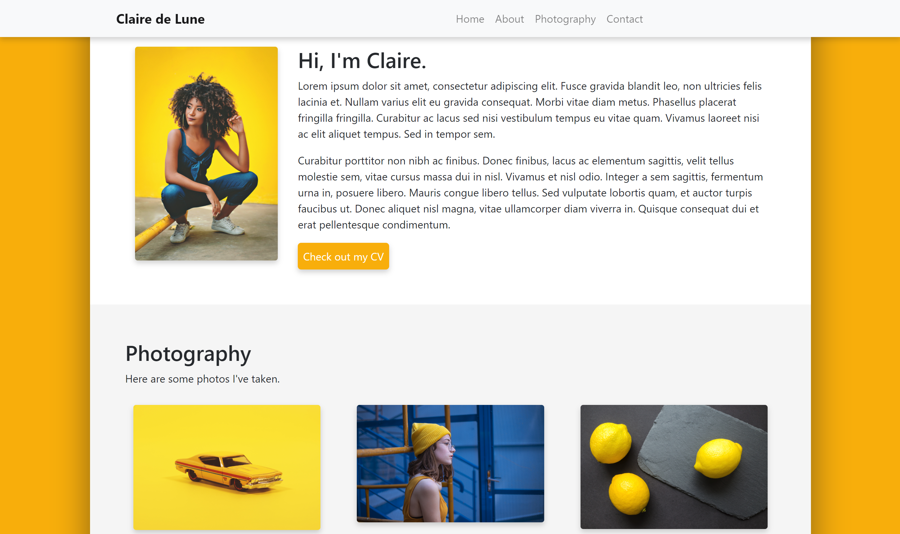
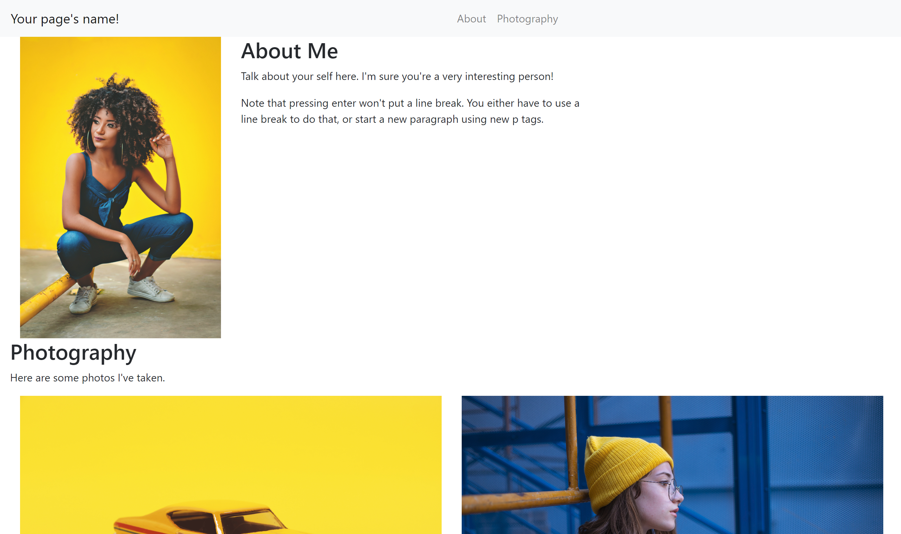
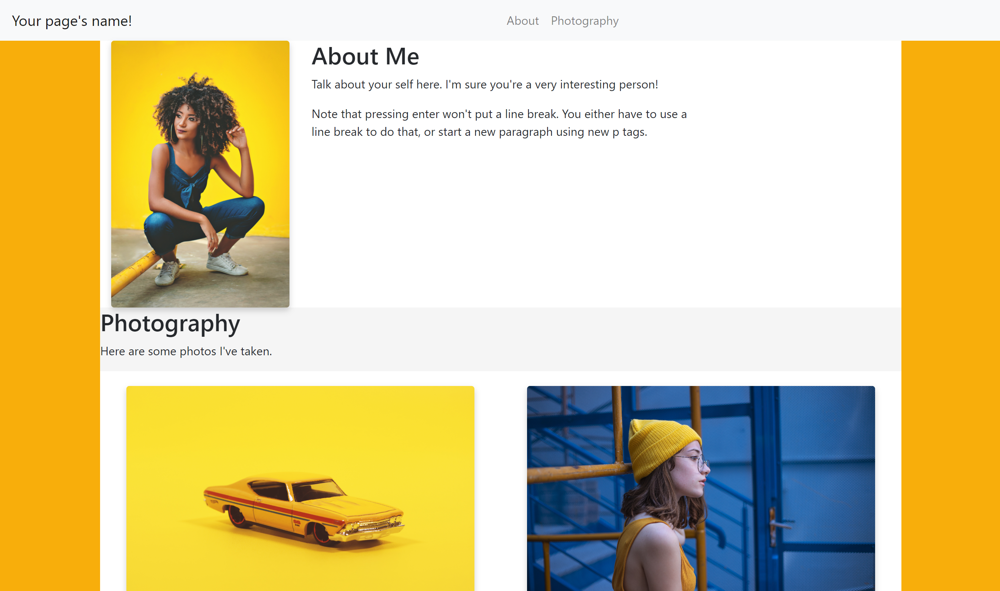
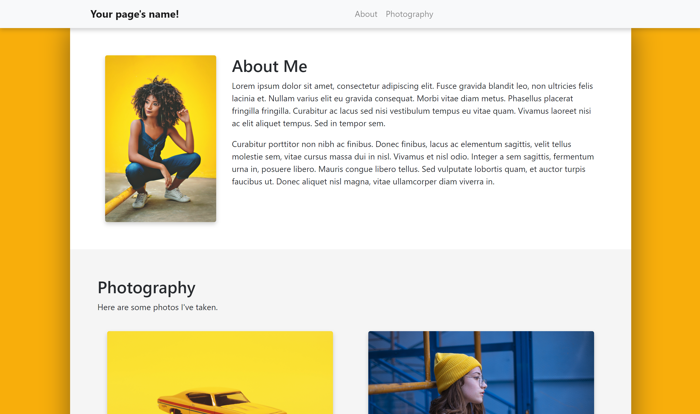
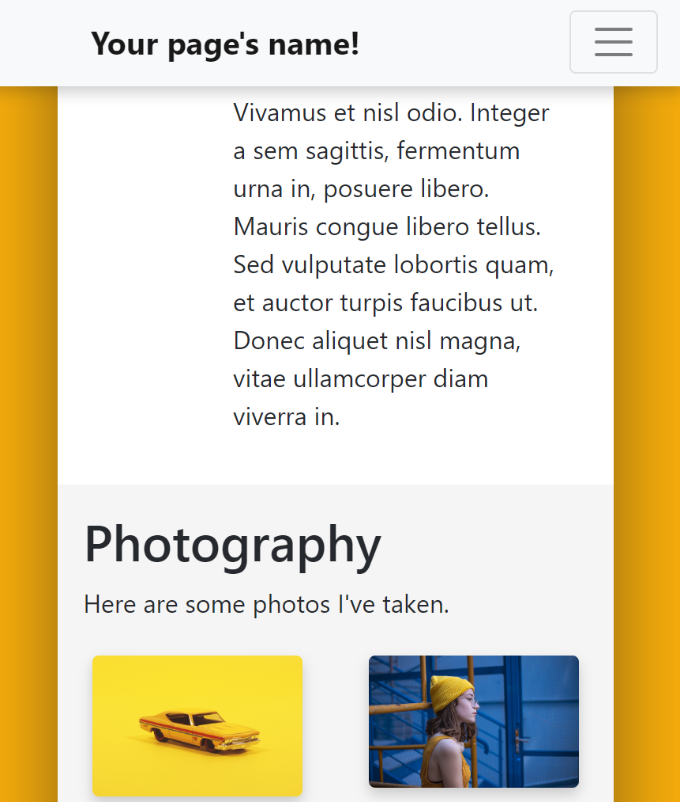

# How to code a simple website using Bootstrap  

  

This guide will teach you how to code a website like the one above.  

Before we get into things, here are some links to resources you might use during 
your web development:  
- https://getbootstrap.com/
- https://www.w3schools.com/
- https://pexels.com  

You'll also need a text editor like Visual Studio Code (which I use), Notepad++, 
or sublime.  

## Step 1: Create an HTML and CSS file in the same location
**HTML** is what holds the content of the page, like text, photos, and links.  
**CSS** is what styles the content of the page, so it has pretty colors and shadows.  
**Bootstrap** is a framework that simplifies coding a website by providing tools 
for making the structure and automatically adjusting for different browser sizes 
(don't you hate when a website loads weird on your desktop vs your phone?).  

Think of it like this: HTML is a blueprint of your rooms and furniture, CSS is an interior 
designer who places everything properly and decorates, and Bootstrap is a carpenter 
who helps make building simpler by providing pre-built arches, doors, etc.  

After creating your file, copy and paste the following boilerplate text into it. 
It's there so we have the files we need to use Bootstrap.  

```html
<!DOCTYPE html>
<html>

	<head>
		<meta charset="utf-8" />
		<meta http-equiv="X-UA-Compatible" content="IE=edge">
		<meta name="viewport" content="width=device-width, initial-scale=1">

		<!-- Our page's title and custom styling file -->
		<title>Your Title Here</title>
		<link rel="stylesheet" href="NAME_OF_YOUR_CSS_FILE.css" type="text/css">

		<!-- Bootstrap files -->
		<link rel="stylesheet" href="https://maxcdn.bootstrapcdn.com/bootstrap/4.0.0/css/bootstrap.min.css" integrity="sha384-Gn5384xqQ1aoWXA+058RXPxPg6fy4IWvTNh0E263XmFcJlSAwiGgFAW/dAiS6JXm" crossorigin="anonymous">
		<script src="https://code.jquery.com/jquery-3.2.1.slim.min.js" integrity="sha384-KJ3o2DKtIkvYIK3UENzmM7KCkRr/rE9/Qpg6aAZGJwFDMVNA/GpGFF93hXpG5KkN" crossorigin="anonymous"></script>
		<script src="https://cdnjs.cloudflare.com/ajax/libs/popper.js/1.12.9/umd/popper.min.js" integrity="sha384-ApNbgh9B+Y1QKtv3Rn7W3mgPxhU9K/ScQsAP7hUibX39j7fakFPskvXusvfa0b4Q" crossorigin="anonymous"></script>
		<script src="https://maxcdn.bootstrapcdn.com/bootstrap/4.0.0/js/bootstrap.min.js" integrity="sha384-JZR6Spejh4U02d8jOt6vLEHfe/JQGiRRSQQxSfFWpi1MquVdAyjUar5+76PVCmYl" crossorigin="anonymous"></script>
	</head>

	<body>

	</body>

</html>
```  

* The ``<head>`` section is the page's data and toolbox -- hence why you should 
change the title to what you want, and make sure your CSS files has the right name. *  

## Step 2: Lay out the structure of the site using Bootstrap tags
Bootstrap uses regular HTML tags like div, span, etc. but has built-in classes. 
If we're using the metaphor from before, these are the walls and arches. 

In the ``<body>`` section is where we put the construction plans. Note that spaces, 
tabs, and anything inside a ``<!-- comment -->`` line comment don't affect your code, 
so use them to organize your stuff. (Also, keep track of your opening and closing tags!)

```html
<body>

    <!-- Navbar (the thing at the top) -->

    <!-- Page content holder -->
    <div class="container-fluid">
        
        <!-- Main column where stuff goes -->
        <div class="col">

            <!-- About section -->
            <div class="row">

            </div>

            <!-- Photo section -->
            <div class="row">

            </div>

        </div>
    </div>

</body>
```

## Step 3: Build the navbar
The navbar is always a little difficult to understand, but luckily, we can just 
copy paste the premade navbar code from the Bootstrap site into our page, right 
below the navbar section we just made:  

```html
<!-- Navbar -->
<nav class="navbar navbar-expand-md navbar-light bg-light justify-content-center">
    
    <a class="navbar-brand d-flex w-50 mr-auto" href="#home">Your page's name!</a>

    <!-- This button replaces the links list when in mobile. -->
    <button class="navbar-toggler" type="button" data-toggle="collapse" data-target="#nav">
        <span class="navbar-toggler-icon"></span>
    </button>

    <!-- Navbar links -->
    <div class="collapse navbar-collapse" id="nav">
        <ul class="nav navbar-nav mr-auto justify-content-end">
            <li class="nav-item">
                <a class="nav-link" href="#about">About</a>
            </li>
            <li class="nav-item">
                <a class="nav-link" href="#photography">Photography</a>
            </li>
        </ul>
    </div>
</nav>
```  

## Step 4: About section
Now we have a navbar with a couple of links! Cool, huh?  
We need to make the stuff that the navbar links to. Under the about section we made, 
add the following:  

```html
<!-- About section -->
<div class="row" id="about"> <!-- Note: this id should match the href of the link in the navbar to link correctly -->

    <div class="col-3">
        
    </div>

    <div class="col-9">
        <h2>About Me</h2>

        <span class="align-middle">
            <p>Talk about yourself here. I'm sure you're a very interesting person!
            </p>

            <p>Note that pressing enter 
            won't 
            put a line break. You either have to use a <br> line break to do that, or 
            start a new paragraph using new p tags.
            </p>
        </span>
    </div>

</div>
```  

Cool, now our About section has a beautiful selfie and some text about us. Now we 
ought to put a little stuff to show off our talents.  

## Step 5: Photo section
For the sake of this tutorial, we'll pretend we're photographers (and if you actually 
are one, then... you're doing great already!).  

```html
<!-- Photography section -->
<div class="row" id="photography">

    <div class="column-fluid">

        <h2>Photography</h2>
        <p>Here are some photos I've taken.</p>

        <!-- Photo gallery -->

    </div>

</div>
```

Now we have an auto-expanding column where we can put a gallery. We'll build the 
photo gallery by using Bootstrap's built-in rows and columns grid system, which 
has 12 "units" horizontally where columns can be placed.  

```html
<!-- Photo gallery -->

<!-- top row -->
<div class="row">
    <div class="col-6">
        <div class="thumbnail">
            
        </div>
    </div>
    <div class="col-6">
        <div class="thumbnail">
            
        </div>
    </div>
</div>

<!-- bottom row -->
<div class="row">
    <div class="col-6">
        <div class="thumbnail">
            
        </div>
    </div>
    <div class="col-6">
        <div class="thumbnail">
            
        </div>
    </div>
</div>
```  

## Step 6: Spiff it up using CSS
By now, your website should look like this:  

  

and the code should look like this:  

```html
<!DOCTYPE html>
<html>

	<head>
		<meta charset="utf-8" />
		<meta http-equiv="X-UA-Compatible" content="IE=edge">
		<meta name="viewport" content="width=device-width, initial-scale=1">

		<!-- Our page's title and custom styling file -->
		<title>Page Title</title>
		<link rel="stylesheet" href="style.css" type="text/css">

		<!-- Bootstrap files -->
		<link rel="stylesheet" href="https://maxcdn.bootstrapcdn.com/bootstrap/4.0.0/css/bootstrap.min.css" integrity="sha384-Gn5384xqQ1aoWXA+058RXPxPg6fy4IWvTNh0E263XmFcJlSAwiGgFAW/dAiS6JXm" crossorigin="anonymous">
		<script src="https://code.jquery.com/jquery-3.2.1.slim.min.js" integrity="sha384-KJ3o2DKtIkvYIK3UENzmM7KCkRr/rE9/Qpg6aAZGJwFDMVNA/GpGFF93hXpG5KkN" crossorigin="anonymous"></script>
		<script src="https://cdnjs.cloudflare.com/ajax/libs/popper.js/1.12.9/umd/popper.min.js" integrity="sha384-ApNbgh9B+Y1QKtv3Rn7W3mgPxhU9K/ScQsAP7hUibX39j7fakFPskvXusvfa0b4Q" crossorigin="anonymous"></script>
		<script src="https://maxcdn.bootstrapcdn.com/bootstrap/4.0.0/js/bootstrap.min.js" integrity="sha384-JZR6Spejh4U02d8jOt6vLEHfe/JQGiRRSQQxSfFWpi1MquVdAyjUar5+76PVCmYl" crossorigin="anonymous"></script>
	</head>

	<body>

    <!-- Navbar -->
    <nav class="navbar navbar-expand-md navbar-light bg-light justify-content-center">
        
        <a class="navbar-brand d-flex w-50 mr-auto" href="#home">Your page's name!</a>

        <!-- This button replaces the links list when in mobile. -->
        <button class="navbar-toggler" type="button" data-toggle="collapse" data-target="#nav">
            <span class="navbar-toggler-icon"></span>
        </button>

        <!-- Navbar links -->
        <div class="collapse navbar-collapse" id="nav">
            <ul class="nav navbar-nav mr-auto justify-content-end">
                <li class="nav-item">
                    <a class="nav-link" href="#about">About</a>
                </li>
                <li class="nav-item">
                    <a class="nav-link" href="#photography">Photography</a>
                </li>
            </ul>
        </div>
    </nav>

    <!-- Page content holder -->
    <div class="container-fluid">
        
        <!-- Main column where stuff goes -->
        <div class="col">

            <!-- About section -->
            <div class="row" id="about"> <!-- Note: this id should match the href of the link in the navbar to link correctly -->

                <div class="col-3">
                    
                </div>

                <div class="col-9">
                    <h2>About Me</h2>

                    <span class="align-middle">
                        <p>Lorem ipsum dolor sit amet, consectetur 
                            adipiscing elit. Fusce gravida blandit leo, non ultricies 
                            felis lacinia et. Nullam varius elit eu gravida consequat. 
                            Morbi vitae diam metus. Phasellus placerat fringilla fringilla. 
                            Curabitur ac lacus sed nisi vestibulum tempus eu vitae quam. 
                            Vivamus laoreet nisi ac elit aliquet tempus. Sed in tempor sem.
                        </p>
                        <p>Curabitur porttitor non nibh ac finibus. Donec finibus, 
                            lacus ac elementum sagittis, velit tellus molestie sem, 
                            vitae cursus massa dui in nisl. Vivamus et nisl odio. 
                            Integer a sem sagittis, fermentum urna in, posuere libero. 
                            Mauris congue libero tellus. Sed vulputate lobortis quam, 
                            et auctor turpis faucibus ut. Donec aliquet nisl magna, 
                            vitae ullamcorper diam viverra in.
                        </p>
                    </span>
                </div>

            </div>

            <!-- Photography section -->
            <div class="row" id="photography">

                <div class="column-fluid">

                    <h2>Photography</h2>
                    <p>Here are some photos I've taken.</p>

                    <!-- Photo gallery -->

                    <!-- top row -->
                    <div class="row">
                        <div class="col-6">
                            <div class="thumbnail">
                                
                            </div>
                        </div>
                        <div class="col-6">
                            <div class="thumbnail">
                                
                            </div>
                        </div>
                    </div>

                    <!-- bottom row -->
                    <div class="row">
                        <div class="col-6">
                            <div class="thumbnail">
                                
                            </div>
                        </div>
                        <div class="col-6">
                            <div class="thumbnail">
                                
                            </div>
                        </div>
                    </div>
                </div>

            </div>

        </div>
    </div>

</body>

</html>
```  

As you can see from the photo, it looks kinda wack. So let's make it fancier using 
CSS. Unlike HTML, CSS doesn't require boilerplate, so just open it and let's add 
some stuff:  

```css
/* This is a comment. It doesn't affect the code and is helpful for organization. */

/* Make the navbar links sliiide to their targets, instead of jumping: */
html {
    scroll-behavior: smooth;
}

/* Color the background and add some space to the sides of the main column: */
.container-fluid {
    background-color: #F8B003;
    padding-left: 10% !important;
    padding-right: 10% !important;
}
/* Note that, above, the !important tag tells the browser to override the preset padding for the .container-fluid class. */

/* Color the main column background white: */
.col {
    background-color: white;
}

/* Put a nice frame and soft shadow around all images on the page: */
img {
    border: 4px solid white;
    border-radius: 4px;
    box-shadow: 0px 4px 8px rgba(17,17,17,0.2);
}

/* Color the second section (photography) for contrast: */
#photography {
    background-color: whitesmoke;
}

/* Space out the photos in our gallery a little: */
.thumbnail {
    margin: 4%;
}
```

And the final result is (imagine a drum roll here):  

  

Cool, this website works, but it still has *a lot* of room for improvement. Let's 
start editing both the HTML *and* CSS so that we can customize the existing Bootstrap 
skeleton to our liking.  

## Step 7: Customize Bootstrap elements in both HTML and CSS
Here is where the difference between ``element``, ``.element``, and ``#element`` 
becomes more important:  
- ``element`` is a built-in tag, such as ````, ``<li>`` (list item), or ``<table>``. It automatically comes with HTML, meaning it's not custom.
- ``.element`` signifies the element is a custom class, like ``.container-fluid``. 
Think of classes like a brand. They can be reused on multiple elements, and anytime 
you create a new element with the class (``<div class="element">``) it automatically 
gets all the class's defined attributes.
    - Notice how all the ``<div class="thumbnail">``-labeled images in our photo 
    gallery got the same ``4%`` padding? That's the class in action!
- ``#element`` signifies the element has a custom ID, like in ``#photography``. An ID  
is typically used only once and refers to a specific thing we defined. Otherwise, it 
behaves exactly like a class.
    - Note that the navbar link, ``<a href="#photography">``, will make the page 
    look for the element with the ID "photography". The link wouldn't work correctly 
    if there were multiple things with that label, as would happen in a class.  

It's also handy to know the difference between ``padding`` and ``spacing``. Although 
both put spacing around an element, they do it in different ways:  
- ``padding`` is like the magma inside Earth. It surrounds the core and puts spacing 
*inside* Earth, between its core and its surface.
- ``spacing`` is like the atmosphere around Earth. It surrounds the Earth too, but it puts spacing *outside* Earth, between its surface and outer space.  

OK, now back to what we were talking about. Let's add secondary classes to some of the 
Bootstrap elements we used before, so we can use the original classes *in addition to* 
customized ones.

In our HTML, we used ``<div class="row">`` elements to separate our sections. Edit 
them so they now say ``<div class="row section"...`` before the id of each ``div`` 
(don't edit the rows we used in the photo gallery).

Then, in the CSS, we'll add some lines that target only rows with the additional 
class "section":

```css
/* Add some padding around the stuff inside the different sections of our page. */
.row.section {
    padding: 5%;
}
```

We can use this trick of adding second classes to existing elements to add a shadow 
around only our main content column, and not other columns (like the ones in the 
photo gallery). Find the ``<div class="col">`` just below the ``container-fluid`` 
div, and add the word "main" after "col". Then, in CSS, we can edit the ``.col {`` 
line to ``.col.main {`` so only the main column is colored white -- the others will 
be transparent, as Bootstrap intended:

```css
/* Color the main column background white: */
/* ...and add a box-shadow shifted 0 right, 0 down, and spread over 50px: */
.col.main {
    background-color: white;
    /* You can also edit the rgba values to make the shadow a different color or darker. */
    box-shadow: 0 0 50px rgba(17,17,17,0.5);
}
```  

Great! Now our spacing is fixed. While we're at it, let's add a shadow to the navbar. 
We don't have to edit the HTML for this, just the CSS, since we're using the default 
navbar.  

```css
/* Add a shadow shifted 4px downward and spread over 8px to the navbar. */
.navbar {
    box-shadow: 0px 4px 8px rgba(17,17,17,0.2);
}
```  

And let's bold the navbar's title (called "brand" by Bootstrap) and move it a 
little to the right, so it aligns with the content column:  

```css
/* Bold the navbar's brand and put spacing on its left so it shifts right. */
.navbar-brand {
    font-weight: bold;
    padding-left: 12%;
}
```

You might notice that the navbar has also been flatly lying on the page. We can 
make it sticky, i.e. it will scroll along with the user, by encasing the navbar 
section in our HTML in another div:  

```html
<!-- Make the navbar "sticky" (sticks to top of screen) -->
<div class="sticky-top">
    
    <!-- Navbar -->
    <nav class="navbar navbar-expand-md navbar-light bg-light justify-content-center">
        
        ...your stuff here...

    </nav>

</div>
```

Our HTML should look like this:  

```html
<!DOCTYPE html>
<html>

	<head>
		<meta charset="utf-8" />
		<meta http-equiv="X-UA-Compatible" content="IE=edge">
		<meta name="viewport" content="width=device-width, initial-scale=1">

		<!-- Our page's title and custom styling file -->
		<title>Page Title</title>
		<link rel="stylesheet" href="style.css" type="text/css">

		<!-- Bootstrap files -->
		<link rel="stylesheet" href="https://maxcdn.bootstrapcdn.com/bootstrap/4.0.0/css/bootstrap.min.css" integrity="sha384-Gn5384xqQ1aoWXA+058RXPxPg6fy4IWvTNh0E263XmFcJlSAwiGgFAW/dAiS6JXm" crossorigin="anonymous">
		<script src="https://code.jquery.com/jquery-3.2.1.slim.min.js" integrity="sha384-KJ3o2DKtIkvYIK3UENzmM7KCkRr/rE9/Qpg6aAZGJwFDMVNA/GpGFF93hXpG5KkN" crossorigin="anonymous"></script>
		<script src="https://cdnjs.cloudflare.com/ajax/libs/popper.js/1.12.9/umd/popper.min.js" integrity="sha384-ApNbgh9B+Y1QKtv3Rn7W3mgPxhU9K/ScQsAP7hUibX39j7fakFPskvXusvfa0b4Q" crossorigin="anonymous"></script>
		<script src="https://maxcdn.bootstrapcdn.com/bootstrap/4.0.0/js/bootstrap.min.js" integrity="sha384-JZR6Spejh4U02d8jOt6vLEHfe/JQGiRRSQQxSfFWpi1MquVdAyjUar5+76PVCmYl" crossorigin="anonymous"></script>
	</head>

	<body>

    <!-- Make the navbar "sticky" (sticks to top of screen) -->
    <div class="sticky-top">
        
        <!-- Navbar -->
        <nav class="navbar navbar-expand-md navbar-light bg-light justify-content-center">
            
            <a class="navbar-brand d-flex w-50 mr-auto" href="#home">Your page's name!</a>

            <!-- This button replaces the links list when in mobile. -->
            <button class="navbar-toggler" type="button" data-toggle="collapse" data-target="#nav">
                <span class="navbar-toggler-icon"></span>
            </button>

            <!-- Navbar links -->
            <div class="collapse navbar-collapse" id="nav">
                <ul class="nav navbar-nav mr-auto justify-content-end">
                    <li class="nav-item">
                        <a class="nav-link" href="#about">About</a>
                    </li>
                    <li class="nav-item">
                        <a class="nav-link" href="#photography">Photography</a>
                    </li>
                </ul>
            </div>
        </nav>

    </div>

    <!-- Page content holder -->
    <div class="container-fluid">
        
        <!-- Main column where stuff goes -->
        <div class="col main">

            <!-- About section -->
            <div class="row section" id="about"> <!-- Note: this id should match the href of the link in the navbar to link correctly -->

                <div class="col-3">
                    
                </div>

                <div class="col-9">
                    <h2>About Me</h2>

                    <span class="align-middle">
                        <p>Lorem ipsum dolor sit amet, consectetur 
                            adipiscing elit. Fusce gravida blandit leo, non ultricies 
                            felis lacinia et. Nullam varius elit eu gravida consequat. 
                            Morbi vitae diam metus. Phasellus placerat fringilla fringilla. 
                            Curabitur ac lacus sed nisi vestibulum tempus eu vitae quam. 
                            Vivamus laoreet nisi ac elit aliquet tempus. Sed in tempor sem.
                        </p>
                        <p>Curabitur porttitor non nibh ac finibus. Donec finibus, 
                            lacus ac elementum sagittis, velit tellus molestie sem, 
                            vitae cursus massa dui in nisl. Vivamus et nisl odio. 
                            Integer a sem sagittis, fermentum urna in, posuere libero. 
                            Mauris congue libero tellus. Sed vulputate lobortis quam, 
                            et auctor turpis faucibus ut. Donec aliquet nisl magna, 
                            vitae ullamcorper diam viverra in.
                        </p>
                    </span>
                </div>

            </div>

            <!-- Photography section -->
            <div class="row section" id="photography">

                <div class="column-fluid">

                    <h2>Photography</h2>
                    <p>Here are some photos I've taken.</p>

                    <!-- Photo gallery -->

                    <!-- top row -->
                    <div class="row">
                        <div class="col-6">
                            <div class="thumbnail">
                                
                            </div>
                        </div>
                        <div class="col-6">
                            <div class="thumbnail">
                                
                            </div>
                        </div>
                    </div>

                    <!-- bottom row -->
                    <div class="row">
                        <div class="col-6">
                            <div class="thumbnail">
                                
                            </div>
                        </div>
                        <div class="col-6">
                            <div class="thumbnail">
                                
                            </div>
                        </div>
                    </div>
                </div>

            </div>
            
        </div>
    </div>

</body>

</html>
```  

And our CSS should look like this:  

```css
/* This is a comment. It doesn't affect the code and is helpful for organization. */

/* Make the navbar links sliiide to their targets, instead of jumping: */
html {
    scroll-behavior: smooth;
}

/* Add a shadow shifted 4px downward and spread over 8px to the navbar. */
.navbar {
    box-shadow: 0px 4px 8px rgba(17,17,17,0.2);
}

/* Bold the navbar's brand and put spacing on its left so it shifts right. */
.navbar-brand {
    font-weight: bold;
    padding-left: 12%;
}

/* Color the background and add some space to the sides of the main column: */
.container-fluid {
    background-color: #F8B003;
    padding-left: 10% !important;
    padding-right: 10% !important;
}
/* Note that, above, the !important tag tells the browser to override the preset 
padding for the .container-fluid class. */

/* Color the main column background white: */
/* ...and add a box-shadow shifted 0 right, 0 down, and spread over 50px: */
.col.main {
    background-color: white;
    /* You can also edit the rgba values to make the shadow a different color or darker. */
    box-shadow: 0 0 50px rgba(17,17,17,0.5);
}

/* Add some padding around the stuff inside the different sections of our page. */
.row.section {
    padding: 5%;
}

/* Put a nice frame and soft shadow around all images on the page: */
img {
    border: 4px solid white;
    border-radius: 4px;
    box-shadow: 0px 4px 8px rgba(17,17,17,0.2);
}

/* Color the second section (photography) for contrast: */
#photography {
    background-color: whitesmoke;
}

/* Space out the photos in our gallery a little: */
.thumbnail {
    margin: 4%;
}
```

Now let's see the result:  

  

Lookin' good! And thanks to Bootstrap, it even looks good on smaller screens:  

  

In fact, this could be a finished site!  
But if you want more, stay tuned for how to add a header section and a contact 
section... coming soon!